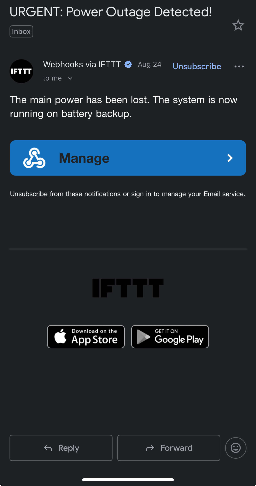

# IoT-Power-Outage-Monitor
An ESP32-based IoT device that detects power failures and sends real-time email alerts via IFTTT
This system is designed to provide immediate awareness of a power grid failure. It uses a standard USB power bank to create a simple Uninterruptible Power Supply (UPS), ensuring the monitor itself remains operational during an outage. When the main 5V power from the wall adapter is lost, the ESP32 detects the voltage drop, connects to a local Wi-Fi network, and sends a webhook to the IFTTT cloud service, which in turn triggers an email notification.

## Components Used

* **Microcontroller:** ESP32 Development Board
* **Power Supply:** 5V USB Wall Adapter (Main) & 10,000mAh USB Power Bank (Backup)
* **Software:** Arduino IDE (C++), IFTTT Webhooks

## Circuit & Wiring
The ESP32 is powered continuously by the USB power bank. A "sense" wire is connected from the 5V line of the main wall adapter to GPIO pin 13 on the ESP32. A common ground is established between the main power line and the ESP32.

## Source Code

  Description:
  This code runs on an ESP32 to monitor the status of the main power supply.
  If the main power (sensed via a 5V line) is lost, the device connects to Wi-Fi
  and sends a webhook to IFTTT to trigger an email notification. The device
  is powered by a USB power bank to ensure it remains operational during an outage.
/**
 * @file power_monitor_main.cpp
 * @author Your Name
 * @brief Monitors a main power supply using an ESP32 and sends an IFTTT notification on failure.
 * @version 1.1
 * @date 2025-09-01
 *
 * @copyright Copyright (c) 2025
 *
 * Description:
 * This code runs on an ESP32 to monitor the status of a main power supply.
 * A 5V signal from the main supply is monitored on a GPIO pin. If this signal is
 * lost, the device connects to a predefined Wi-Fi network and sends a webhook to
 * IFTTT, which can trigger an email, push notification, or other alert.
 * The ESP32 itself should be powered by an uninterruptible power source, such as a
 * USB power bank, to ensure it remains operational during a power outage.
 */

#include <WiFi.h>
#include <HTTPClient.h>
#include "config.h" // Include the separate configuration file

// --- Pin Definitions ---
const int SENSE_PIN = 13; // GPIO pin to sense the main power status.

// --- Global Variables ---
bool alertSent = false; // Tracks if an alert has been sent to prevent spam.
unsigned long lastCheckTime = 0; // Stores the last time the power status was checked.

// --- Constants ---
const int WIFI_RETRY_LIMIT = 20;    // How many times to retry Wi-Fi connection.
const long CHECK_INTERVAL_MS = 5000; // Interval between power status checks (5 seconds).

/**
 * @brief Connects the ESP32 to the configured Wi-Fi network.
 *
 * @return true if the connection is successful, false otherwise.
 */
bool connectToWiFi() {
    Serial.print("Connecting to WiFi...");
    WiFi.begin(WIFI_SSID, WIFI_PASSWORD);

    int retryCount = 0;
    while (WiFi.status() != WL_CONNECTED && retryCount < WIFI_RETRY_LIMIT) {
        delay(500);
        Serial.print(".");
        retryCount++;
    }
    Serial.println();

    if (WiFi.status() == WL_CONNECTED) {
        Serial.println("WiFi connected!");
        Serial.print("IP Address: ");
        Serial.println(WiFi.localIP());
        return true;
    } else {
        Serial.println("WiFi connection failed.");
        return false;
    }
}

/**
 * @brief Sends a notification to IFTTT via a webhook.
 */
void sendNotification() {
    if (WiFi.status() != WL_CONNECTED) {
        Serial.println("Not connected to WiFi. Cannot send notification.");
        return;
    }

    HTTPClient http;
    String url = "http://maker.ifttt.com/trigger/" + String(IFTTT_EVENT_NAME) + "/with/key/" + String(IFTTT_KEY);

    http.begin(url);
    int httpResponseCode = http.GET();

    if (httpResponseCode > 0) {
        Serial.printf("Notification sent! HTTP Response code: %d\n", httpResponseCode);
    } else {
        Serial.printf("Error sending notification. HTTP Error code: %s\n", http.errorToString(httpResponseCode).c_str());
    }

    http.end();
}

void setup() {
    Serial.begin(115200);
    // Wait a moment for the serial monitor to connect.
    delay(100);
    Serial.println("Power Outage Monitor Initializing...");

    pinMode(SENSE_PIN, INPUT);

    // Initial check message
    Serial.println("Performing initial power check...");
}

void loop() {
    // Use a non-blocking delay to check the power status periodically.
    if (millis() - lastCheckTime >= CHECK_INTERVAL_MS) {
        lastCheckTime = millis();

        int powerState = digitalRead(SENSE_PIN);

        if (powerState == LOW) { // Power is OUT
            if (!alertSent) {
                Serial.println("POWER OUTAGE DETECTED!");
                if (connectToWiFi()) {
                    sendNotification();
                    alertSent = true; // Mark alert as sent to avoid spamming
                    WiFi.disconnect(true); // Disconnect to save power
                    Serial.println("WiFi disconnected.");
                }
            }
        } else { // Power is ON
            if (alertSent) {
                Serial.println("Power has been restored. Resetting alert status.");
                alertSent = false;
            } else {
                Serial.println("Power is ON. All systems normal.");
            }
        }
    }
}
